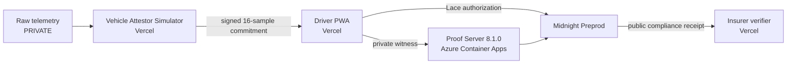
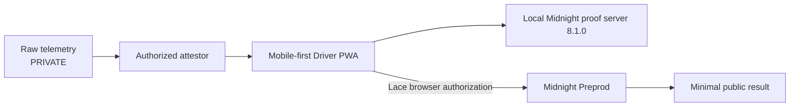

# DriveProof

> Prove you drove safely without revealing where you drove.

Built for the **Midnight Hackathon - August 2026**
Track: **Mobile Track**

DriveProof is a mobile-first PWA that lets a driver prove that telemetry issued by an authorized vehicle attestor satisfies an insurer's safety policy without revealing the raw trip telemetry to the insurer or public ledger.

## Live demo

### Primary reliable demo URLs

- **Driver:** <https://driveproof-driver-atharv.vercel.app/driver>
- **Insurer:** <https://driveproof-insurer-atharv.vercel.app>

### Optional custom aliases

- <https://driveproof.atharv.me>
- <https://verify.driveproof.atharv.me>

The `*.vercel.app` URLs are the recommended judge entry points because the custom Driver hostname has shown resolver-specific failures on some clients. Both aliases remain attached to their Vercel projects.

## The problem

Usage-based insurance commonly asks for detailed:

- route and location history;
- speed history;
- braking history; and
- trip telemetry.

The insurer usually needs a smaller answer:

> Did this signed trip satisfy the safety policy?

DriveProof separates that compliance answer from the sensitive journey behind it.

## How it works

1. The Driver connects Lace on Midnight Preprod.
2. The browser derives a private subject binding from a client-side driver secret.
3. The Vehicle Attestor Simulator issues a signed 16-sample trip commitment. The browser sends the attestor a trip ID and driver binding; it does not choose the speed, braking, coordinates, salt, or attestation ID.
4. Each private sample contains:
   - `gridX`
   - `gridY`
   - `speed`
   - `braking` event flag
   - `timeBucket`
5. Compact checks the registered attestor, signature and trip-commitment integrity, subject binding, every policy predicate, and replay state.
6. A successful proof consumes the contract-local attestation nullifier and increments public `complianceCount`.
7. The Insurer receives a public compliance receipt and transaction metadata, not the raw trip.

## Core thesis

**Zero knowledge protects privacy.**

**Attestation protects integrity.**

Zero knowledge lets Midnight evaluate predicates over private witness data without publishing the telemetry. The issuer signature binds the committed data to an authorized attestor, so changing a private value invalidates the proof rather than creating a different compliant trip.

## Final policy

| Policy field | Current value |
| --- | --- |
| Samples | 16 private telemetry samples |
| Maximum speed | 80 km/h for every sample |
| Harsh braking | At most 2 events; `braking > 0` counts as one event |
| Allowed operating area | Inclusive private grid rectangle: `X 0..350`, `Y 50..100` |
| Authorized attestor | Provider 1 |
| Replay protection | Contract-local nullifier derived from the attestation ID |
| Subject binding | Derived from a private client-side driver secret |

The rectangle is an **allowed operating area** policy: every private sample must be inside the inclusive bounds. It is not described as prohibited-zone avoidance.

## Why Midnight

An ordinary hash can commit to a route or telemetry file, but it does not let an insurer verify a policy predicate over hidden values. The driver would need to reveal the preimage, or a traditional backend would need to receive and retain the raw telemetry. A hash also does not, by itself, prove that an authorized issuer signed the committed measurement or enforce contract-local replay protection.

Midnight provides the combination DriveProof needs:

- private witnesses;
- zero-knowledge policy predicates;
- registered-attestor verification;
- minimal public disclosure; and
- contract-local nullifier/replay protection.

## Privacy boundary

### Private driver-side witness

- 16 telemetry samples
- private grid positions
- speed history
- braking history
- time buckets
- salt
- signature witness
- driver secret

### Public insurer and ledger surface

- policy identifier
- attestor identifier
- compliant result
- transaction ID and block metadata
- contract/public chain state required by the protocol

The public receipt does not contain coordinates, speed arrays, braking arrays, time buckets, salt, driver binding, driver secret, or raw signature material.

The hosted deployment uses a remotely hosted proof server for accessibility. The privacy-maximal configuration uses the local Midnight proof server so proving can remain in the user's environment before transaction submission. Because a hosted prover is remote, DriveProof does not claim that private witness bytes literally never leave the browser.

The safe claim is:

> Raw telemetry is not written to public ledger state and is not included in the insurer receipt.

## Prototype trust boundary

**Vehicle Attestor Simulator is the prototype trust root.**

DriveProof proves integrity and policy compliance after that trust boundary. It does not independently prove physical sensor provenance, and it does not claim that the simulator itself cannot lie.

Production replacements could include:

- an OEM telematics control unit;
- a secure vehicle computer;
- a trusted OBD device; or
- a hardware-backed telemetry issuer.

## Real Midnight evidence

The final stack has been accepted against the real Midnight Preprod path:

- final constructor-bound contract deployment succeeded;
- a real safe 16-sample proof succeeded;
- real Lace approval and Preprod submission succeeded;
- replay was rejected with `Attestation already used`;
- unsafe speed was rejected with `Speed exceeds policy limit`;
- out-of-geofence data was rejected with `Sample outside policy geofence`;
- telemetry tampering was rejected with `Invalid attestation signature`; and
- braking-policy acceptance passed the contract test suite.

The exact transaction identifiers recorded in this repository are kept in [`docs/PREPROD_EVIDENCE.md`](docs/PREPROD_EVIDENCE.md). No new transaction IDs are invented in this README.

## Architecture

### Public hosted demo

### Privacy-maximal local proving

The same Compact contract and policy apply in both deployment modes. The hosted proof server is a deployment choice, not a change to cryptographic semantics.

## Why this fits the Mobile Track

- The Driver experience is a mobile-first PWA designed for phone-sized screens.
- Sensitive trip information stays on the private side of the product experience and proof boundary.
- Only a ZK-backed compliance result and necessary public metadata are submitted publicly.
- The Insurer never receives route, speed, braking, or raw telemetry history.
- Local prover configuration provides the strongest device-local proving path.
- Current Preprod wallet authorization uses the Lace desktop/browser extension; Lace Mobile does not currently support Midnight signing.

## Business value

DriveProof could support usage-based auto insurance, fleet compliance, safe-driver discounts, commercial-driver certification, and privacy-preserving telematics programs. The value is reducing the need to retain complete route and behavior histories when an insurer only needs a verified risk predicate. Production hardware trust, regulatory review, and commercial pricing remain outside this hackathon prototype.

## Product surfaces

- `/` - product landing page
- `/driver` - mobile-first Driver workspace
- `/insurer` - Insurer public receipt workspace
- `/wallet-debug` - engineering diagnostics
- `/wallet-debug/transaction` - real Lace/Preprod transaction harness

The polished product uses the explicit `DriveProofClient` boundary. `MockDriveProofClient` remains available for local UI development and is visibly labeled `MOCK · PRODUCT PREVIEW`. Midnight mode is visibly labeled `REAL · MIDNIGHT PREPROD` and never silently falls back to mock.

## Tech stack

- Midnight Compact
- Midnight.js
- Lace browser extension
- Midnight Preprod
- React, Vite, and TypeScript
- Node.js 22+
- Vercel
- Azure Container Apps
- Vehicle Attestor Simulator
- Midnight proof server `8.1.0`, local or remotely hosted

## Repository structure

    apps/driver                    Driver PWA and real transaction harness
    apps/insurer                   Insurer public receipt view
    contract                       Compact source and generated contract artifacts
    attestation/attestor-simulator Vehicle Attestor Simulator
    shared/driveproof-client       Mock and Midnight client boundary
    shared/midnight-runtime        Browser-safe Midnight provider harness
    shared/midnight-wallet         Lace connection and Preprod validation
    preprod-cli                    Isolated CLI experimentation path
    docs                           Evidence, deployment, demo, and judge material

## Run locally

Requirements: Node.js 22+, npm, Docker Desktop, Chrome/Brave with Lace for real wallet actions.

    npm install
    npm run dev:driver
    # another terminal
    npm run dev:insurer

For the local real path, start the pinned proof server and attestor first:

    docker run --rm -p 6300:6300 midnightntwrk/proof-server:8.1.0 midnight-proof-server -v

    Set-Location attestation/attestor-simulator
    npm run dev

The attestor requires a private, persistent `PROVIDER_SECRET_KEY` in `attestation/attestor-simulator/.env`. Never commit, print, rotate, or place it in Vite variables. Set `VITE_DRIVEPROOF_CLIENT_MODE=midnight` only in the app environment when intentionally running the real path; otherwise the product defaults to the clearly labeled mock preview.

See [`docs/JUDGE_QUICKSTART.md`](docs/JUDGE_QUICKSTART.md) and [`docs/DEMO_RUNBOOK.md`](docs/DEMO_RUNBOOK.md) for the exact manual Lace flow.

## Security model

### What DriveProof proves

- The registered attestor signed the committed trip.
- The committed trip is bound to the private subject binding.
- The private samples satisfy the speed, braking, and allowed-area predicates.
- The attestation has not already been consumed by the contract-local replay check.

### What DriveProof does not prove

- That the simulator received data from a physical car.
- That the simulator or another issuer cannot lie.
- That production OEM/OBD hardware trust has been implemented.
- Physical GPS or sensor provenance.

The attestor service owns its persistent provider secret. The secret never belongs in browser code, Vite environment variables, logs, README files, or committed files. Lace owns wallet signing. No seed, mnemonic, or private witness belongs in this repository or public receipt.

## Final development status

The final hackathon stack includes the mobile-first Driver, Insurer receipt surface, real Midnight client, final 16-sample/braking/geofence contract, subject binding, replay protection, hosted Vercel surfaces, Azure proof-server deployment, and recorded real Preprod acceptance. A production physical telemetry trust root remains a future integration, not a claim of this prototype.

## Team split

Atharv owns the product apps, shared frontend/domain types, client boundary, Lace/Preprod integration, deployment, documentation, demo UX, and submission materials. Ashiha owns the Compact contract, attestor cryptography, generated artifacts, contract tests, and cryptographic phases.

## Judge materials

- [`docs/PREPROD_EVIDENCE.md`](docs/PREPROD_EVIDENCE.md) - bounded real acceptance evidence.
- [`docs/JUDGE_QUICKSTART.md`](docs/JUDGE_QUICKSTART.md) - fastest inspection and manual reproduction path.
- [`docs/DEMO_SCRIPT.md`](docs/DEMO_SCRIPT.md) - spoken script.
- [`docs/FINAL_VIDEO_SHOTLIST.md`](docs/FINAL_VIDEO_SHOTLIST.md) - timed recording plan.
- [`docs/DEVPOST_DRAFT.md`](docs/DEVPOST_DRAFT.md) - submission narrative.
- [`docs/DEPLOYMENT.md`](docs/DEPLOYMENT.md) - hosted architecture and safe configuration.

## Testing

    npm test
    npm run typecheck
    npm run build --workspace @driveproof/driver
    npm run build --workspace @driveproof/insurer
    npm run build --workspace driveproof-attestor-simulator
    npm run build --workspace driveproof-contract
    npm run build --workspace @driveproof/preprod-cli
