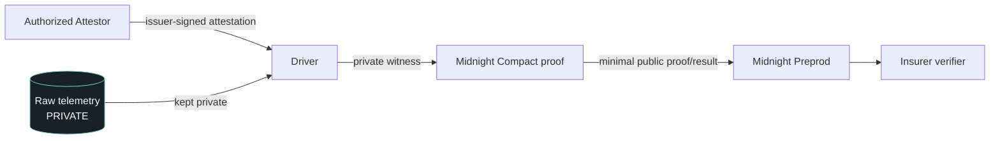

# DriveProof

> Judge-facing submission draft. The current product shell, wallet connectivity spike, and attestor simulator are implemented; the DriveProof Compact contract, generated bindings, and genuine proof transaction remain pending contract handoff.

## One-line pitch

“Prove you drove safely without revealing where you drove.”

## Technical thesis

“DriveProof proves that telemetry issued by an authorized attestor satisfies an insurer's safety policy without revealing the telemetry.”

“Zero knowledge protects privacy. Attestation protects integrity.”

## Problem

Usage-based insurance normally asks drivers to surrender detailed driving and location history so an insurer can evaluate risk. That can expose routes, origins, destinations, speed patterns, and braking behavior far beyond what is needed to answer one question: did this trip satisfy the safety policy?

## Solution

DriveProof is designed around this flow:

```text
authorized telemetry issuer
        → private telemetry
        → Compact policy evaluation
        → minimal public proof/result
        → insurer verifies compliance without raw telemetry
```

The driver receives telemetry from an authorized issuer. The telemetry remains a private witness while the Midnight Compact program evaluates the insurer's policy. The insurer receives only the public proof/result needed to verify compliance. The Compact evaluation and public result are pending the cryptographic contract handoff; the current product flow is an explicitly labelled mock simulation.

## Why Midnight

An ordinary hash can commit to a route or telemetry file, but it does not let an insurer verify a policy predicate over hidden values. The driver would still need to disclose the underlying data, or a traditional backend would need to receive and trust the raw telemetry. A hash also does not, by itself, establish that an authorized attestor signed the data or prevent a result from being reused.

Midnight is relevant because the intended architecture combines:

- private witnesses, so raw telemetry can stay with the driver;
- zero-knowledge policy predicates, so compliance can be checked without revealing the witness;
- registered-attestor verification, so the proof is tied to an authorized issuer;
- minimal disclosure, so the insurer learns the result rather than the route and history;
- deterministic nullifier/replay protection, once the contract implementation is delivered.

The registered attestor, exact witness encoding, Compact predicates, nullifier behavior, and generated contract interface are pending contract handoff. No current mock value is presented as a real Midnight proof or transaction.

## Prototype trust boundary

The hackathon prototype simulates the authorized vehicle telemetry issuer. DriveProof proves integrity and policy compliance after that trust boundary; it does not independently prove physical sensor provenance.

Production replacements could include an OEM TCU, trusted OBD hardware, or hardware-backed telemetry providers.

## Private vs public data

The private side is the intended witness boundary. The public side below lists categories only; it does not guess the final contract fields or encodings.

| Private intended | Public / expected category |
| --- | --- |
| Telemetry samples | Compliance result — exact final field pending contract handoff |
| Route/grid locations | Policy identifier — exact final field pending contract handoff |
| Speed history | Attestor identifier — exact final field pending contract handoff |
| Braking history | Nullifier/replay reference — exact final field pending contract handoff |
| Attestation signature/material as appropriate | Transaction/proof reference, if returned — exact final field pending contract handoff |
| Subject secret | Additional public metadata, if required — exact final field pending contract handoff |

Public fields are categories only. Exact final public fields, names, encodings, and returned structure are **PENDING CONTRACT HANDOFF**. Mock transaction and nullifier values are not public-chain truth.

The intended private boundary includes raw telemetry, route/grid positions, speed and braking history, the attestation material as appropriate, and the subject secret. The insurer view must not expose those values.

## Demo script draft — maximum 2 minutes

| Time | Shot | Honest narration / action |
| --- | --- | --- |
| 0:00–0:12 | Problem | Usage-based insurance asks for detailed route and driving history. DriveProof separates the safety result from that private history. |
| 0:12–0:30 | Private Driver trip | Show the mobile-first Driver PWA with the deterministic safe fixture, private route/grid view, and local telemetry panel. This is product-simulator data today. |
| 0:30–0:55 | DriveProof generation | Reserved for the genuine Compact proof path after contract handoff. Before then, show only the clearly labelled **MOCK UX SIMULATION** and state that no real DriveProof transaction exists yet. |
| 0:55–1:12 | Insurer verified view | Show the insurer surface receiving a proof-shaped result without route or raw telemetry. The current verified state is mock; call it a real verification only after the contract path is complete. |
| 1:12–1:30 | Unsafe trip rejection | Switch to the unsafe fixture. The Driver sees the private failure; the insurer receives a generic rejection and does not see the violating speed. |
| 1:30–1:46 | Tamper rejection | Show the attempted private substitution from attested 112 to modified 71. The current UI demonstrates the scenario; it does not claim to detect cryptographic tampering. The genuine Compact checkpoint is pending. |
| 1:46–1:56 | Replay rejection, if completed | Resubmit the same safe attestation/policy pair. The current client simulates replay after a successful safe proof; the real contract nullifier is pending if not delivered. |
| 1:56–2:00 | Final thesis | “Zero knowledge protects privacy. Attestation protects integrity.” |

The script is intentionally honest about the current state: the pre-handoff demo uses the mock client and must retain its mock disclosure. The “real DriveProof generation” segment becomes a genuine claim only after the Compact checkpoint, generated bindings, and Preprod transaction are delivered and verified.

## Technical judge Q&A

### How do you know the telemetry is genuine?

Today, the prototype simulates the authorized telemetry issuer. The intended Compact path verifies an issuer signature from a registered attestor and binds the private witness to that attestation and subject. This does not establish physical sensor provenance.

### What exactly does zero knowledge prove?

It is intended to prove that a private telemetry witness matches an accepted attestation and satisfies the insurer's policy predicates, while withholding the witness. The exact predicates and generated proof interface are pending the Compact handoff.

### What prevents changing 112 to 71?

The attestation is intended to bind the signed value. A substituted witness should no longer match the original signature, so the Compact proof should be rejected. The signed 67 / 112 / tamper checkpoint is pending; the frontend does not independently detect cryptographic tampering.

### What prevents replay?

The intended contract path uses a deterministic nullifier and contract state to reject the same valid attestation/policy use twice. The MockDriveProofClient simulates this behavior only after a successful safe proof. The real nullifier implementation is pending if not delivered.

### Why not just hash the route?

A hash commits to exact data but does not prove a hidden safety predicate, verify an authorized signer, or provide replay protection by itself. Revealing the preimage defeats the privacy goal; sending it to a traditional backend makes that backend a holder of the sensitive history.

### Why is the attestor trusted?

The attestor is the trust anchor for the telemetry claim. The prototype explicitly simulates that issuer. The intended production design registers its public key and verifies its signature, but it does not claim that the issuer has independently proven physical sensor provenance.

### Does DriveProof prove physical GPS provenance?

No. The hackathon prototype simulates the authorized vehicle telemetry issuer. Production would need an OEM TCU, trusted OBD hardware, or another hardware-backed telemetry provider if physical provenance were required.

### Why Midnight?

Midnight is intended to combine private witnesses, zero-knowledge policy predicates, registered-attestor verification, and a minimal public result with replay protection in contract state. The genuine DriveProof Compact implementation is pending; the current app does not pretend its mock flow is that implementation.

### What remains private?

The intended private data includes telemetry samples, route/grid locations, speed history, braking history, attestation material as appropriate, and the subject secret. The insurer must not receive raw telemetry or exact route information.

### Why is this Mobile-track relevant despite Lace Mobile not yet supporting Midnight?

The Driver experience is a mobile-first PWA designed for a phone-sized viewport. The hackathon prototype separates that product experience from the current wallet limitation: Midnight signing is performed through Lace in a desktop/browser environment for the genuine transaction path. No native Android app is required for the product concept.

### Why is the final wallet signing done through Lace desktop/browser?

Current Midnight wallet support uses the Lace browser extension; Lace Mobile on Android does not currently support Midnight, and Lace cannot sign against the local undeployed Midnight network. The intended genuine path is therefore Midnight Preprod plus the Lace desktop/browser extension.

### What would production architecture change?

The simulator would be replaced by a production attestor such as an OEM TCU, trusted OBD device, or hardware-backed telemetry service. A persistent provider key would remain in the attestor service, its public key would be registered on Midnight, and the Driver would use the generated Compact client and Lace on Preprod. The insurer would receive only the exact public fields defined by the completed contract.

## Current implementation status

### Done

- Driver PWA.
- Insurer verifier.
- Lace browser connection.
- Midnight Preprod wallet validation.
- Proof server 8.1.0 local path.
- Midnight runtime/provider harness.
- Hosted Driver and Insurer surfaces.
- Attestor simulator Phase 0: deterministic product-side fixtures and issuer simulation only; this is not physical telemetry provenance or the final cryptographic attestor integration.

### Pending

- Signed 67 / 112 / tamper Compact checkpoint.
- Generated DriveProof contract bindings.
- Real DriveProof transaction.
- Deterministic nullifier and contract replay behavior, if not yet delivered.
- Telemetry expansion and geofence behavior, if not yet delivered.
- Exact public field names, encodings, and transaction/result structure from the contract handoff.

The Lace and Preprod work proves wallet/provider infrastructure only. It does not constitute a DriveProof contract call, proof, or transaction.

## Architecture diagram

Target architecture; Compact contract and generated binding are pending contract handoff.



## Security assumptions

- **Trusted issuer assumption:** the authorized telemetry issuer is trusted to issue accurate telemetry. The current prototype simulates this issuer and makes no physical-provenance claim.
- **Unique attestation IDs:** attestation identifiers are expected to be unique for replay tracking; exact representation is pending contract handoff.
- **Subject binding:** the proof must bind the private witness and attestation to the intended subject; the exact subject-binding input is pending.
- **Persistent provider key:** the attestor service owns `PROVIDER_SECRET_KEY`. It must persist across restarts; its corresponding public key is what gets registered on Midnight. The secret must never enter browser code, Vite environment variables, logs, the README, or committed files.
- **Replay protection:** the intended contract uses a deterministic nullifier and persistent contract state. This is pending until the real implementation and tests are delivered; mock replay state is not contract state.
- **No physical-provenance claim:** DriveProof proves integrity and policy compliance after the issuer trust boundary, not that a physical GPS or vehicle sensor produced the telemetry.

No contract address, policy encoding, attestor encoding, generated binding, transaction ID, or final public-field schema is invented here. Those details remain **PENDING CONTRACT HANDOFF**.
